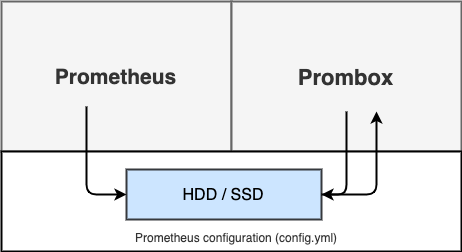

[](/LICENSE) [](https://github.com/Comcast/prombox/actions?query=workflow%3A%22CI+Pipeline%22+branch%3A%22main%22)

# Prombox
Sandbox environment for editing and testing prometheus configuration on the fly.

## Motivation

[Prometheus](https://prometheus.io) users often have trouble configuring new targets or creating alerts and recording rules because getting the YAML syntax exactly right can be a struggle. When running Prometheus locally this isn't as big of a challenge because you have direct access to the config file and can make changes quickly. Once Prometheus is deployed into a production environment, however, this becomes challenging because you don't have the ability to re-create the same combination of configuration and environment.

This is especially challenging when you're taking advantage of some service discovery methods provided by Prometheus, like AWS EC2 discovery. You may be able to discover your instance hosts via the AWS EC2 API, but accessing the endpoint your application exposes metrics on may not work due to firewall rules. Prometheus needs to live within your AWS VPC or private network in order for the metric scraping to occur successfully.

For these reasons, we built "Prombox", a lightweight UI that allows users to build the Prometheus config file and alerts/recording rules. This could be deployed within your environment (AWS VPC, etc) along with an instance of Prometheus that mimics your production instance. This would create a "sandbox" that allows you to "play" with new rules and configuration options to see how they would work.



## Build and Run Docker image

### Build Prombox

```
make build
```

### Build Docker Image
```
docker build -t prombox -f build/Dockerfile .
```

### Run docker-compose

```
docker-compose up
```

### Access UI

The Prombox UI is accessible at `http://localhost:3000`

The Prometheus UI is accessible at `http://localhost:9090`

## Run and Test Locally

### Set Environment Variables

#### Required
```bash
export PROMETHEUS_ADDRESS=http://localhost:9090
export PROMETHEUS_FRAME_ADDRESS=http://localhost:9090
export PROMETHEUS_CONFIG=$(pwd)/prometheus/prometheus.yml
```
#### Optional
```bash
export PORT=3000 (default: 3000)
export CORS_ALLOW_ORIGIN=http://localhost:8080 (default: empty)
```

### Run

1. Run Prometheus at :9090 (using configuration in `/data/prometheus/prometheus.yml`)
    ```
    docker run \
        -p 9090:9090 \
        --mount type=bind,source="$(pwd)"/data/prometheus/prometheus.yml,target=/etc/prometheus/prometheus.yml \
        prom/prometheus:v2.28.1 \
        --web.enable-lifecycle \
        --config.file=/etc/prometheus/prometheus.yml \
        --storage.tsdb.path=/prometheus \
        --web.console.libraries=/etc/prometheus/console_libraries \
        --web.console.templates=/etc/prometheus/consoles
    ```
1. Run Alertmanager at :9093 (using configuration in `/data/alertmanager/alertmanager.yml`)
    ```
    docker run \
        -p 9093:9093 -p 9094:9094 \
        --mount type=bind,source="$(pwd)"/data/alertmanager/alertmanager.yml,target=/etc/alertmanager/alertmanager.yml \
        prom/alertmanager:v0.22.0 \
        --config.file=/etc/alertmanager/alertmanager.yml \
        --storage.path=/alertmanager \
        --log.level=info
    ```

2. Run API at :3000
    ```
    export PROMETHEUS_ADDRESS=http://localhost:9090
    export PROMETHEUS_FRAME_ADDRESS=http://localhost:9090
    export PROMETHEUS_CONFIG=$(pwd)/data/prometheus/prometheus.yml
    export CORS_ALLOW_ORIGIN=http://localhost:8080
    make run-api-dev
    ```

3. Run ui with hot-reloading at :8080
    ```
    make run-ui-dev
    ```

## Lint
Linting go (go fmt + go vet + golint) and vue (npm lint) source code
```
make lint
```

## Test

### Unit Tests
Run unit tests for ui
```
make test-ui
```

Run unit tests for go
```
make test-api
```

Run unit tests for both ui and go
```
make test
```

## Upgrading Dependencies

### Prometheus
https://github.com/prometheus/prometheus/issues/7663
https://github.com/prometheus/prometheus/issues/9302

`go get github.com/prometheus/prometheus@v2.28.1` doesn't work because prometheus doesn't follow golang version semantics. Instead, use one of the following commands:

- `go get github.com/prometheus/prometheus@release-2.28`
- `go get github.com/prometheus/prometheus@b094459` (Given that `b094459` is the commit for `v2.28.1`)

In both cases, you will see `github.com/prometheus/prometheus v1.8.2-0.20210701133801-b0944590a1c9` in the `go.mod` file.

### Go mody tidy
Clean up the go.sum file with `go mod tidy`

## Copyright and License
This project is made available under the [Apache License, Version 2.0](LICENSE). Copyright information can be found in [NOTICE](NOTICE).

## Code of Conduct
See the [Code of Conduct](CODE_OF_CONDUCT.md).
